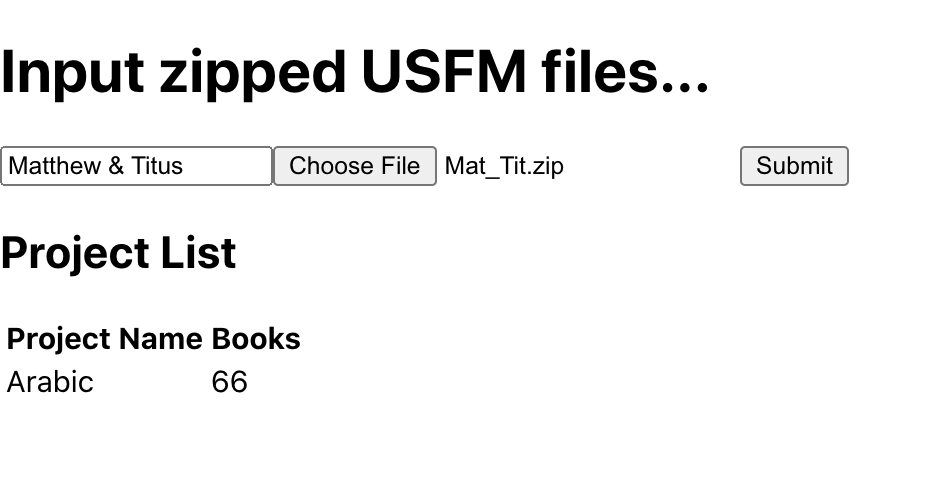

<div id="top"></div>

<!-- PROJECT SHIELDS -->
<!--
*** I'm using markdown "reference style" links for readability.
*** Reference links are enclosed in brackets [ ] instead of parentheses ( ).
*** See the bottom of this document for the declaration of the reference variables
*** for contributors-url, forks-url, etc. This is an optional, concise syntax you may use.
*** https://www.markdownguide.org/basic-syntax/#reference-style-links
-->

[![Contributors][contributors-shield]](https://github.com/kintsoogi/zip-project/graphs/contributors)
[![Forks][forks-shield]](https://github.com/kintsoogi/zip-project/network/members)
[![Stargazers][stars-shield]](https://github.com/kintsoogi/zip-project/stargazers)
[![Issues][issues-shield]](https://github.com/kintsoogi/zip-project/issues)
[![MIT License][license-shield]](https://github.com/kintsoogi/zip-project/blob/main/LICENSE)

<!-- PROJECT LOGO -->
<br />
<div align="center">

<h3 align="center">Zip Project</h3>

  <p align="center">
    Library to use and export USFM zip files. 
    <br />
    <a href="https://zip-project.netlify.app/"><strong>View Demo and examples</strong></a>
    <br />
    <br />
    ·
    <a href="https://github.com/kintsoogi/zip-project/issues">Report Bug</a>
    ·
    <a href="https://github.com/kintsoogi/zip-project/issues">Request Feature</a>
  </p>
</div>

<!-- TABLE OF CONTENTS -->
<details>
  <summary>Table of Contents</summary>
  <ol>
    <li>
      <a href="#about-the-project">About The Project</a>
      <ul>
        <li><a href="#built-with">Built With</a></li>
      </ul>
    </li>
    <li>
      <a href="#getting-started">Getting Started</a>
      <ul>
        <li><a href="#installation">Installation</a></li>
      </ul>
    </li>
    <li><a href="#usage">Usage</a></li>
    <li><a href="#roadmap">Roadmap</a></li>
    <li><a href="#contributing">Contributing</a></li>
    <li><a href="#license">License</a></li>
  </ol>
</details>

<!-- ABOUT THE PROJECT -->

## About The Project



**Purpose**

- Create functionality to open usfm zip files, edit them, and export them to a zip file.

**Scope**

- The goal of this library is to provide helper functions to open and export zipped usfm files. UI/UX design is minimal as to be kept reusable by in whatever user interface this functionality is used in.

<p align="right">(<a href="#top">back to top</a>)</p>

### Built With

- [React.js](https://reactjs.org/)

<p align="right">(<a href="#top">back to top</a>)</p>

<!-- GETTING STARTED -->

## Getting Started

This is an example of how you may give instructions on setting up your project locally.
To get a local copy up and running follow these simple example steps.

### Installation/First Steps

If you wish to use this library in your app you will need to add it as a dependency with:

```sh
npm install uw-editor
```

OR

```shell
yarn add uw-editor
```

Also you will need to add the peer dependencies:

```shell
npm install @mui/material @mui/styles @mui/icons-material  @mui/styled-engine npm:@mui/styled-engine-sc@latest react react-dom translation-helps-rcl
```

OR

```shell
yarn add @mui/material @mui/styles @mui/icons-material  @mui/styled-engine npm:@mui/styled-engine-sc@latest react react-dom translation-helps-rcl
```

<p align="right">(<a href="#top">back to top</a>)</p>

<!-- USAGE EXAMPLES -->

## Usage/Integration

See [Styleguidist link](https://zip-project.netlify.app/) for many usage examples.

<p align="right">(<a href="#top">back to top</a>)</p>

<!-- ROADMAP -->

## Roadmap

See the [open issues](https://github.com/kintsoogi/zip-project/issues) for a full list of proposed features (and known issues).

<p align="right">(<a href="#top">back to top</a>)</p>

<!-- CONTRIBUTING -->

## Contributing

Contributions are what make the open source community such an amazing place to learn, inspire, and create. Any contributions you make are **greatly appreciated**. [Guidelines for external contributions.](https://forum.door43.org)

You can also simply open an issue with the tag "enhancement".
Don't forget to give the project a star! Thanks again!

If you would like to fork the repo and create a pull request.

1. Fork the Project
2. Clone the repo
   ```sh
   git clone https://github.com/kintsoogi/zip-project.git
   ```
3. Install NPM packages

   ```sh
   yarn
   ```

4. Create your Feature Branch (`git checkout -b feature/AmazingFeature`)
5. Commit your Changes (`git commit -m 'Add some AmazingFeature'`)
6. Push to the Branch (`git push origin feature/AmazingFeature`)
7. Open a Pull Request

<p align="right">(<a href="#top">back to top</a>)</p>

<!-- LICENSE -->

## License

Distributed under the MIT License. See `LICENSE` for more information.

<p align="right">(<a href="#top">back to top</a>)</p>

<!-- MARKDOWN LINKS & IMAGES -->
<!-- https://www.markdownguide.org/basic-syntax/#reference-style-links -->

[contributors-shield]: https://img.shields.io/github/contributors/kintsoogi/zip-project.svg?style=for-the-badge
[contributors-url]: https://github.com/kintsoogi/zip-project/graphs/contributors
[forks-shield]: https://img.shields.io/github/forks/kintsoogi/zip-project.svg?style=for-the-badge
[forks-url]: https://github.com/kintsoogi/zip-project/network/members
[stars-shield]: https://img.shields.io/github/stars/kintsoogi/zip-project.svg?style=for-the-badge
[stars-url]: https://github.com/kintsoogi/zip-project/stargazers
[issues-shield]: https://img.shields.io/github/issues/kintsoogi/zip-project.svg?style=for-the-badge
[issues-url]: https://github.com/kintsoogi/zip-project/issues
[license-shield]: https://img.shields.io/github/license/kintsoogi/zip-project.svg?style=for-the-badge
[license-url]: https://github.com/kintsoogi/zip-project/blob/master/LICENSE.txt
[linkedin-shield]: https://img.shields.io/badge/-LinkedIn-black.svg?style=for-the-badge&logo=linkedin&colorB=555
[linkedin-url]: https://linkedin.com/in/linkedin_username
[product-screenshot]: images/screenshot.png
